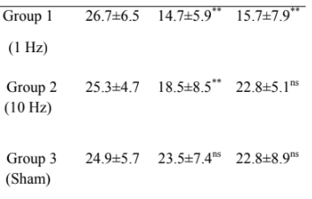

###

From the first document 'independent subgroups in a study', we combined the outcomes (pre and post) for the 1Hz group and the 10Hz group  
But to compute the effect size against the control group, we need to first compute by comparing the means of the pre and post outcomes

###

### Looking at the data again (YBOCS score)



### Also from the previous results:

```{r}
pre_m=26
pre_sd=5.618504
post_m=16.6
post_sd=7.444368
print(c(pre_m,pre_sd,post_m,post_sd))
```

### Constructing the functions:

```{r}
m_diff = function(m1,m2) {
  m1-m2
}
```

###

```{r}
sd_diff = function(sd1,sd2,r) {
  sqrt(sd1^2 + sd2^2 - 2*r*sd1*sd2)
}
```

###

### Calculating the differences between outcomes

We may take r=0.5; but this could also be imputated using the results of the past researches  

```{r}
treatment_m = m_diff(post_m,pre_m)
treatment_sd = sd_diff(post_sd,pre_sd,r=0.5)
control_m = m_diff(23.5,24.9)
control_sd = sd_diff(7.4,5.7,r=0.5)
print(c(treatment_m,treatment_sd))
print(c(control_m,control_sd))
```

###

### SMD between the treatment arms and control arm

```{r}
hedgesg <- function(n1, m1, sd1, n2, m2, sd2) {
df <- n1 + n2 - 2
J <- 1 - (3 / (4*df - 1))
S <- sqrt(((n1-1)*(sd1^2) + (n2-1)*(sd2^2))/df)
d <- (m1-m2) / S
g <- J*d
return(g)
}
```

```{r}
hedgesg(30,treatment_m,treatment_sd,15,control_m,control_sd)
```

