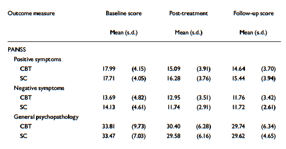
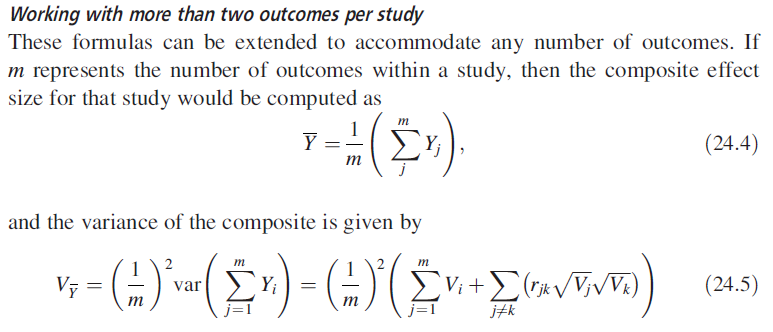
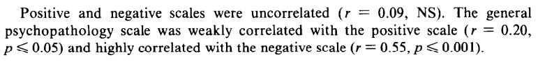

###

Sometimes we may need to combine the data reported from a study, e.g. they are reporting two related scales, or, they are reporting subscales separately without the aggregate scores.

###



###

For example, in an RCT conducted in 2005, they are trying to look for any improvements in PANSS score after CBT in schiz patients.  However, only the subscale has been reported.  Therefore, we need to combine the scores before the meta-analysis.

###



###

### Setting up the functions

```{r}
m_subgroup = function(m) {
  sum(m) / length(m)
}
```

```{r}
sd_subgroup = function(sd,r) {
  k = length(sd)
  a = (1/k)^2
  b = sum(sd^2)
  x = matrix(rep(0,k^2),nrow = k)
  for (i in 1:k) {
    for(j in 1:k) {
      x[i,j] = r[i,j]*sd[i]*sd[j]
    }
  }
  x[lower.tri(x,diag = T)] = 0
  c = sum(x)
  sqrt(a*(b+c))
}
```

###

### Defining r



```{r}
r_PANSS = matrix(c(0,0.09,0.2,0.09,0,0.55,0.2,0.55,0),byrow = T,nrow = 3)
r_PANSS
```

###

### Combining the scores

```{r}
pre_CBT_m = m_subgroup(c(17.99,13.69,33.81))
pre_CBT_sd = sd_subgroup(c(4.15,4.82,9.73),r_PANSS)
c(pre_CBT_m,pre_CBT_sd)
```

### Verify by hand

```{r}
a = (1/3)^2
b = sum(c(4.15,4.82,9.73)^2)
c = 0.09*4.15*4.82 + 0.2*4.15*9.73 + 0.55*4.82*9.73
sqrt(a*(b+c))
```

### Combining the others

```{r}
pre_SC_m = m_subgroup(c(17.71,14.13,33.47))
pre_SC_sd = sd_subgroup(c(4.05,4.61,7.03),r_PANSS)
post_CBT_m = m_subgroup(c(15.09,12.95,30.4))
post_CBT_sd = sd_subgroup(c(3.91,3.51,6.28),r_PANSS)
post_SC_m = m_subgroup(c(16.28,11.74,29.58))
post_SC_sd = sd_subgroup(c(3.76,2.91,6.16),r_PANSS)
```

### The results

```{r}
results = matrix(c(pre_CBT_m,pre_CBT_sd,post_CBT_m,post_CBT_sd,
                   pre_SC_m,pre_SC_sd,post_SC_m,post_SC_sd),
                 byrow = T,
                 nrow = 2)
colnames(results) = c('Pre-mean','(SD)','Post-mean','(SD)')
rownames(results) = c('CBT','SC')
results
```

